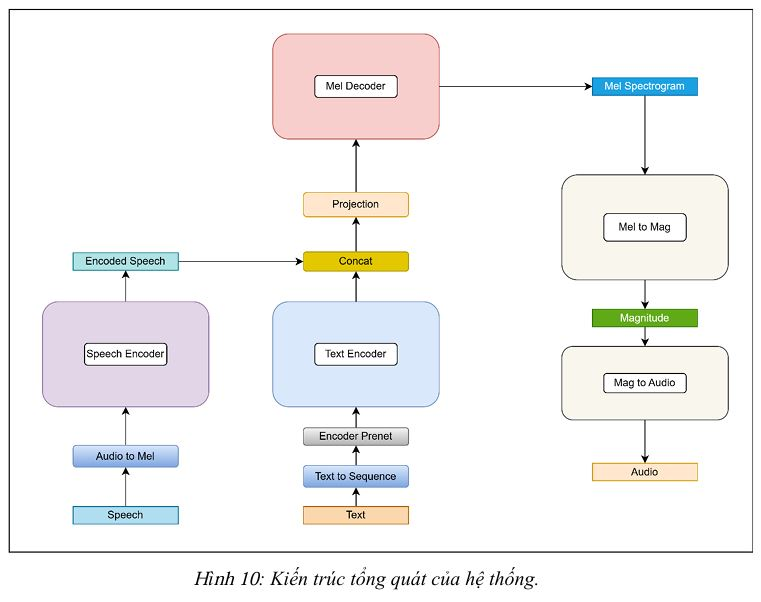
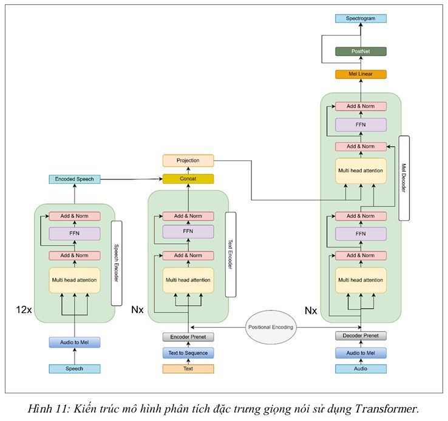
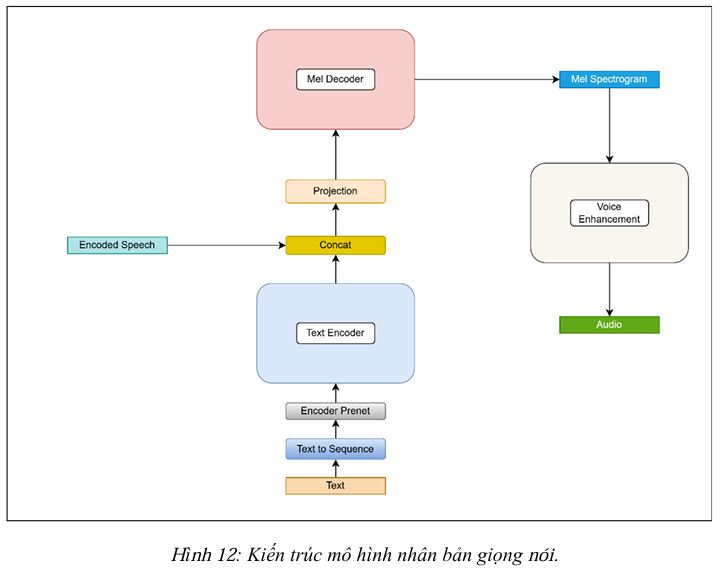
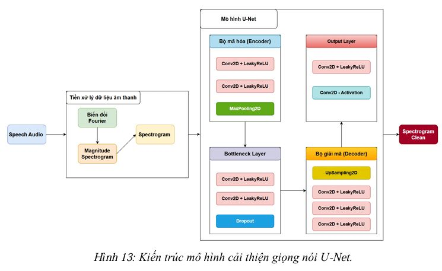
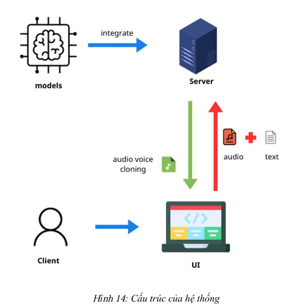
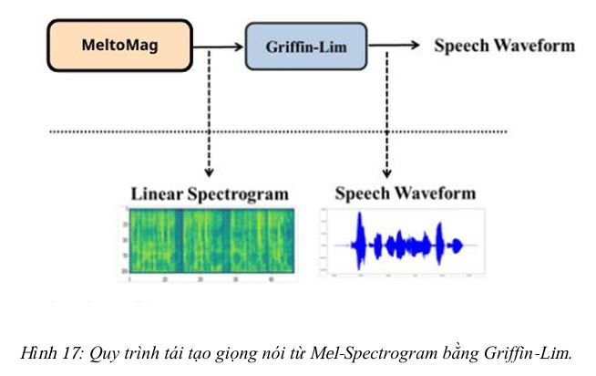
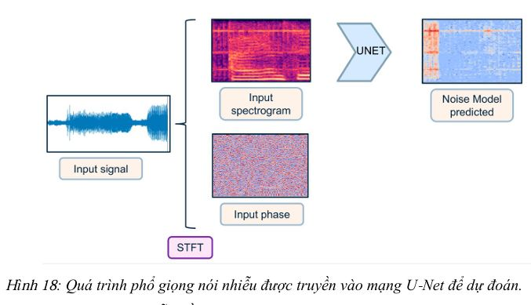
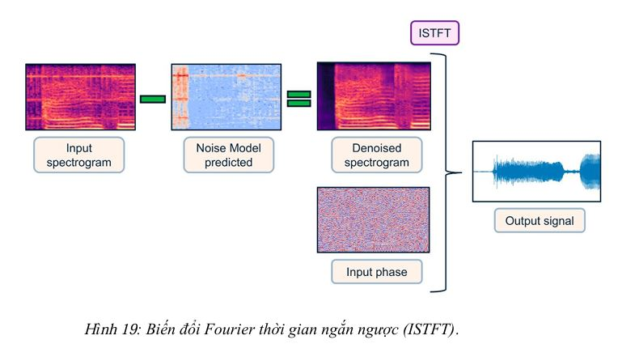
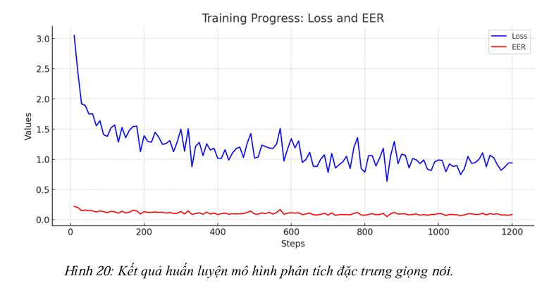
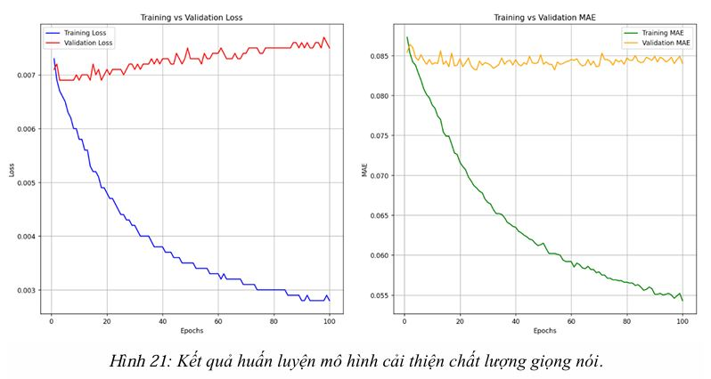

# 🎙️ Hệ Thống Chuyển Văn Bản Thành Giọng Nói Tiếng Việt (Text-to-Speech) 🇻🇳

## 🌟 Giới thiệu

Dự án phát triển **Hệ thống chuyển đổi văn bản thành giọng nói (Text-to-Speech)** với khả năng nhân bản giọng nói chuyên sâu dành riêng cho tiếng Việt. Hệ thống ứng dụng các công nghệ tiên tiến nhất hiện nay như **Deep Learning**, **Transformer**, **U-Net**, **Tacotron**, **FastSpeech**, **VITS** và sử dụng mô hình tiền huấn luyện **XTTS-v2**.

---

## ▶️ Video Demo

📺 Video demo hệ thống xem [tại đây](https://www.youtube.com/watch?v=LRkJD9daWrs)

---

## 🚀 Chức năng chính

- 🔊 **Chuyển văn bản thành giọng nói tiếng Việt:** Tạo ra âm thanh tự nhiên với độ chính xác cao từ văn bản đầu vào.
- 🎤 **Nhân bản giọng nói:** Có thể nhân bản giọng nói từ một đoạn ghi âm ngắn ban đầu.
- 🎚️ **Khử nhiễu và cải thiện chất lượng âm thanh:** Loại bỏ nhiễu, tạp âm, giúp âm thanh rõ ràng hơn.
- 🔍 **So sánh và phân tích độ tương đồng giọng nói:** Kiểm tra và xác định mức độ tương đồng giữa các giọng nói.

---

## 🛠️ Công nghệ sử dụng

### Frontend

- ⚛️ **React (with Vite):** Phát triển giao diện người dùng nhanh chóng, trực quan và hiệu suất cao.
- 🎨 **HTML/CSS/JavaScript:** Thiết kế giao diện hiện đại, thân thiện và tương tác tốt.

### Backend

- 🐍 **Python 3.11:** Xử lý logic backend mạnh mẽ, dễ dàng mở rộng.
- 🌐 **FastAPI:** Framework phát triển API nhanh chóng, hiệu suất vượt trội và bảo mật.
- 📚 **TensorFlow, PyTorch:** Các thư viện deep learning hàng đầu hỗ trợ huấn luyện và triển khai mô hình.
- 🎧 **Librosa, Soundfile:** Thư viện xử lý âm thanh chuyên sâu, trích xuất và phân tích đặc trưng giọng nói.

### Deep Learning Models

- 🧠 **Transformer:** Kiến trúc mạng học sâu giúp xử lý ngôn ngữ tự nhiên và âm thanh hiệu quả.
- 📢 **Tacotron:** Chuyển đổi văn bản sang Mel Spectrogram.
- 🚅 **FastSpeech:** Mô hình nhanh chóng tổng hợp giọng nói với độ ổn định cao, không sử dụng attention.
- 🔊 **VITS:** Mô hình tiên tiến kết hợp VAE và GAN để tổng hợp giọng nói tự nhiên nhất.
- 🌀 **U-Net:** Kiến trúc mạng CNN hiệu quả trong việc xử lý và khử nhiễu âm thanh.
- 📌 **XTTS-v2:** Mô hình pretrained đa ngôn ngữ chuyên biệt cho giọng nói Việt Nam, khả năng tái tạo và chuyển đổi giọng nói linh hoạt.

---

## 📂 Cấu trúc dự án

```
Voice_cloning_VN
│
├── frontend          # Giao diện React
├── backend           # Backend FastAPI
├── ai                # Cách mô hình Deep Learning được huấn luyện
├── data              # Dữ liệu được thu thập, tiền xử lý và sử dụng

```

---

## 📸 Các hình ảnh minh họa

### 🚧 Giải pháp xây dựng mô hình Deep Learning
| | | | |
|---|---|---|---|
|  |  |  |  |

### 🎨 Thiết kế và triển khai hệ thống
| | | | |
|---|---|---|---|
|  |  |  |  |

### 📊 Kết quả mô hình
| | |
|---|---|
|  |  |

---

## 🚧 Hướng dẫn cài đặt

### Clone Repository
```bash
git clone https://github.com/tttiuem2k3/Voice_cloning_VN.git
cd Voice_cloning_VN
```

### Backend
```bash
pip install -r requirements.txt
```

### Frontend
```bash
cd frontend
npm install
npm run dev
```

### Tải mô hình pretrained XTTS-v2
```python
from huggingface_hub import snapshot_download
model_dir = r"./Model"
snapshot_download(repo_id="thinhlpg/viXTTS", repo_type="model", local_dir=model_dir)
```

---

## 🌱 Cách thức đóng góp

Bạn có thể tham gia đóng góp theo các cách sau:

- ⭐ Đánh giá sao repository
- 🐞 Báo cáo các vấn đề qua mục [issues](https://github.com/tttiuem2k3/Voice_cloning_VN/issues)
- 📥 Tạo pull request để cải thiện dự án

---

## 📜 Tham khảo

- [Tacotron](https://github.com/Rayhane-mamah/Tacotron-2)
- [FastSpeech](https://github.com/ming024/FastSpeech2)
- [XTTS-v2](https://huggingface.co/coqui/XTTS-v2)

---

##  📞 Liên hệ
- 📧 Email: tttiuem2k3@gmail.com
- 👥 Linkedin: [Thịnh Trần](https://www.linkedin.com/in/thinh-tran-04122k3/)
- 💬 Zalo - phone: +84 329966939 hoặc +84 336639775

---

🌟 **Trần Tấn Thịnh – ĐH Bách Khoa Đà Nẵng – 2025** 🌟
